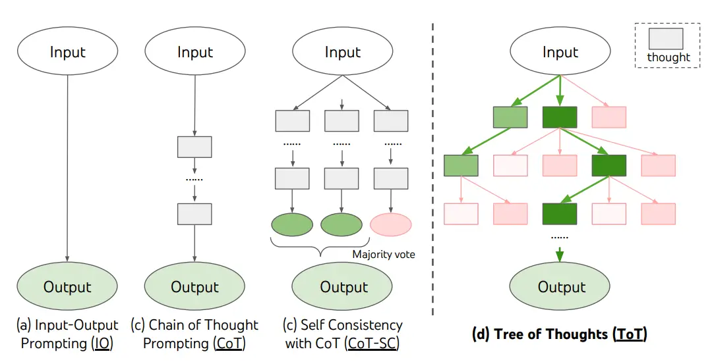

# Tree of Thoughts (ToT)

For complex tasks that require exploration or strategic lookahead, traditional or simple prompting techniques fall short. Yao et el. (2023) and Long (2023) recently proposed Tree of Thoughts (ToT), a framework that generalizes over chain-of-thought prompting and encourages exploration over thoughts that serve as intermediate steps for general problem solving with language models.

ToT maintains a tree of thoughts, where thoughts represent coherent language sequences that serve as intermediate steps toward solving a problem. This approach enables an LM to self-evaluate the progress through intermediate thoughts made towards solving a problem through a deliberate reasoning process. The LM's ability to generate and evaluate thoughts is then combined with search algorithms (e.g., breadth-first search and depth-first search) to enable systematic exploration of thoughts with lookahead and backtracking.

When using ToT, different tasks requires defining the number of candidates and the number of thoughts/steps. For instance, as demonstrated in the paper, Game of 24 is used as a mathematical reasoning task which requires decomposing the thoughts into 3 steps, each involving an intermediate equation. At each step, the best b=5 candidates are kept.

To perform BFS in ToT for the Game of 24 task, the LM is prompted to evaluate each thought candidate as "sure/maybe/impossible" with regard to reaching 24. As stated by the authors, "the aim is to promote correct partial solutions that can be verdicted within few lookahead trials, and eliminate impossible partial solutions based on "too big/small" commonsense, and keep the rest "maybe"". Values are sampled 3 times for each thought.